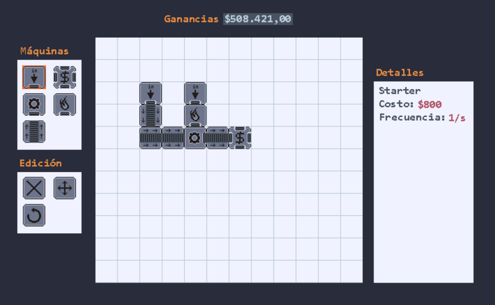
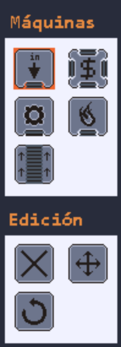

# Trabajo Práctico Integrador Grupal “Revolución Industrial”

## Introducción
Revolución Industrial es un idle game en donde se busca diseñar una línea de producción. El objetivo es generar la mayor cantidad de dinero posible por segundo. Para ello se cuenta con una grilla acotada en la cual pueden colocarse máquinas que procesan materiales y los mezclan con otros para generar productos con valor agregado.

Está inspirado en juegos como [Factorio](https://www.factorio.com/) (levemente) y [Assembly Line](https://play.google.com/store/apps/details?id=com.olympus.assemblyline) (fuertemente)

## Primera entrega: Standalone Web App

Para la primer entrega se busca tener una aplicación web standalone (es autosuficiente y no requiere interactuar con un backend) desarrollada utilizando React+Redux.

A continuación se detallan algunos componentes:

### Fábrica:
Es una grilla acotada en donde pueden colocarse máquinas.

### Toolbox:
Es un componente de GUI que permite:

 * Seleccionar un tipo de máquina que luego se colocará en la grilla haciendo click en una celda.
 * Seleccionar una acción a realizar: rotar máquina, eliminar máquina, mover máquina.

Cada acción a realizar funciona como un modo de edición, similar a un pincel en una aplicación de dibujo. Por ejemplo, luego de seleccionar la acción de “eliminar”, el usuario puede eliminar máquinas haciendo click sobre ellas; si luego quiere depositar máquinas, selecciona un tipo de máquina y a partir de ese momento puede depositar máquinas realizando clicks sobre las celdas de la fábrica.

###  Starter: 
Desde este componente ingresa materia prima a nuestra fábrica.
Al seleccionarlo se puede elegir el tipo de materia prima que proveerá.

###  Seller: 
Se depositan en este componente los productos que estén listos para ser vendidos.

###  Crafter:
Toma como input materia prima y otros productos.
Al seleccionarlo se puede elegir, de una lista de recetas,  el tipo de producto que generará. Esta receta especifica también los productos esperados como input.
(Las recetas pueden inventarlas ustedes, si eso resulta ser un problema podemos proveerles ejemplos).

###  Transporter:
Es una cinta transportadora que permite mover productos de una celda a otra.

###  Furnace:
Recibe como input un metal y retorna el mismo metal en estado líquido.

## Para esta entrega se espera :
* Tener una versión (usable!) de la app web deployada GitHub Pages.
* Tener la versión debidamente taggeada.
* Tests unitarios y de componentes.
* Tener configurada una branching strategy.
* Tener configurados chequeos previos a mergear una PR (code review, que TravisCi corra un linter, todos los tests pasando, etc.)
* Tener automatizado el deploy a GitHub Pages utilizando TravisCi.
* Tener trazabilidad de user stories y tasks utilizando GitHub Projects, Trello o algún otro servicio.

## Recomendaciones
* No limitarse a lo que vimos en clase. Avanzar por cuenta propia está bien siempre y cuando se logren los requerimientos de la entrega.
* Planificar el trabajo y crear varios issues con antelación (si bien no necesariamente todos).
* Comenzar con componentes sueltos. Probarlos usando [Storybook](https://github.com/storybooks/storybook) y [Enzyme](https://airbnb.io/enzyme/).
* Hacer a los componentes inmutables. El estado de la aplicación debería ser manejado por Redux.
* Trabajar para reducir el boilerplate y que sea cómodo para programar y testear.
* Comenzar con un CI básico desde el comienzo, y luego ir agregándole funcionalidades.
